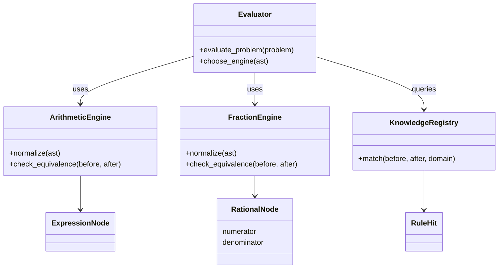

# Engine UML Design v2.3
## ArithmeticEngine / FractionEngine / Evaluator / Registry

---

---

## 設計ポイント

- Evaluator は AST 内に RationalNode を検出すると FractionEngine を使用  
- ArithmeticEngine と FractionEngine はどちらも  
  `normalize()` → `match()` → `EvaluationResult` を返す  
- KnowledgeRegistry が ARITH-* と FRAC-* を domain で振り分ける  
